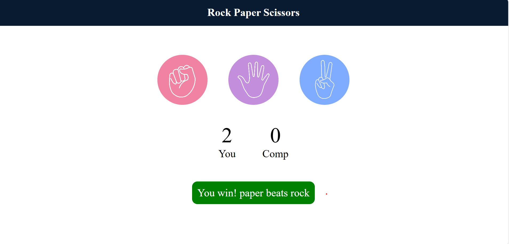
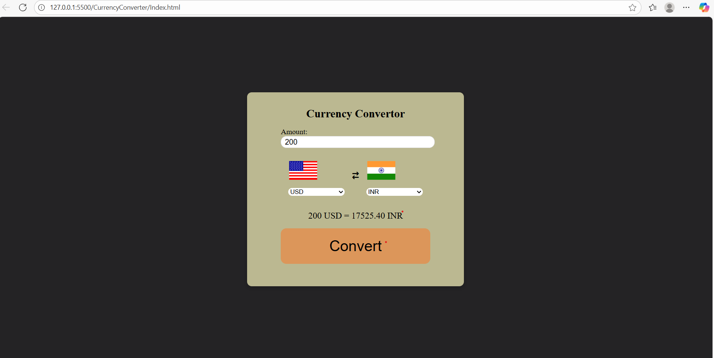

## 📂 Projects Overview

### 1️. Tic Tac Toe
A simple browser-based Tic Tac Toe game for two players.  
Players take turns placing **X** or **O** until one wins or the game ends in a draw.  

---

### 2️. Rock Paper Scissors
Challenge the computer in this quick decision-making game.  
Choose Rock 🪨, Paper 📄, or Scissors ✂️ and see if you win!  

---

### 3️. Currency Converter
Convert between world currencies using a real-time API.  
Features:
- Select currencies from dropdowns
- Instant conversion  
- Live exchange rates  

